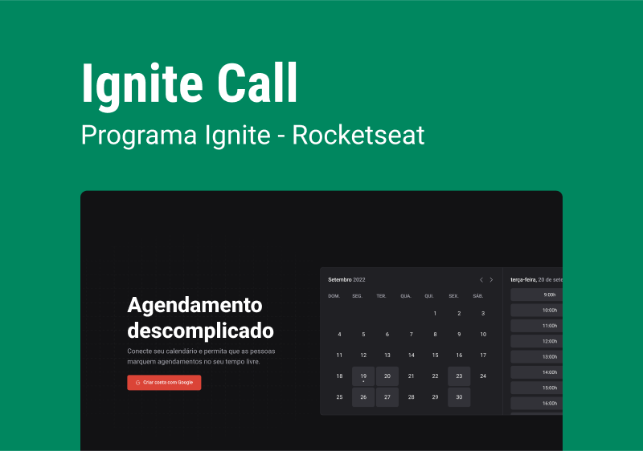
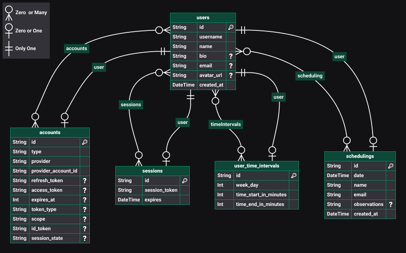
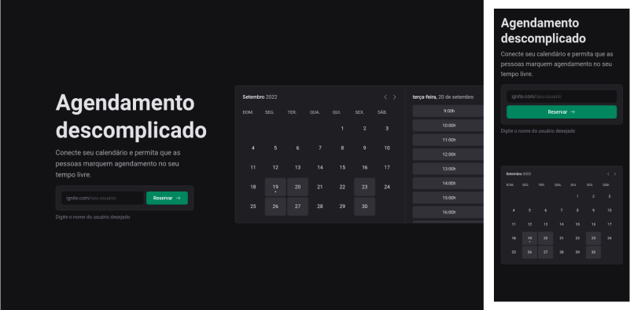
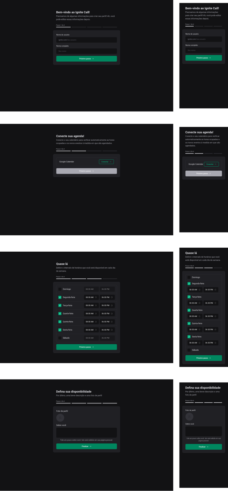
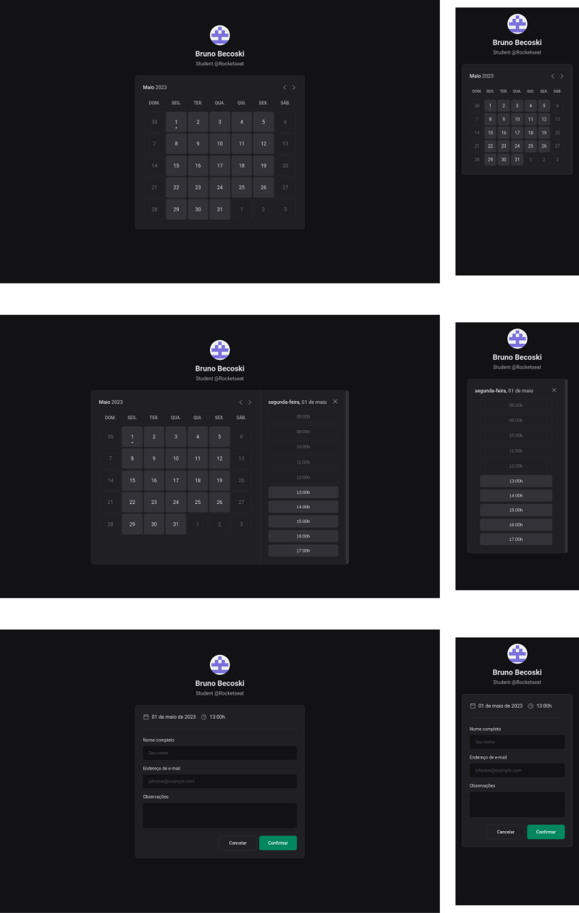

<h1 align="center">
  
</h1>

 

<strong>Ignite Call</strong> é uma aplicação que marca agendamentos no <i>Google Calendar</i>

  <a href="#tecnologias">Tecnologias</a>
  |
  <a href="#mysql">MySQL</a>
  |
  <a href="#layout">Layout</a>

 

  

## Tecnologias
- [TypeScript](https://www.typescriptlang.org)
- [Next.js](https://nextjs.org)
- [Prisma](https://www.prisma.io)
- [MySQL](https://www.mysql.com)

## MySQL

  

## Layout

### Landing

  

### Register

  

### Calendar

  

